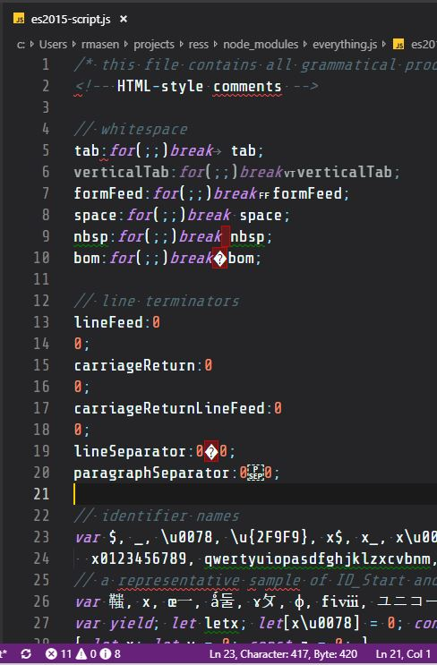

# cursor-index README

Provides additional information about the current cursor position.

In the status bar there will be a new entry with the actual new line, byte and character index of the last index of any selected text.

The below example from [https://github.com/michaelficarra/everything.js] you can see that Javascript allows for 5 new lines (`\r`, `\n`, `\r\n`, `\u{2028}`, `\u{2029}`) but the vscode native line count has 2 fewer rendered lines while this extension reports the actual instances of all new lines.  Vscode also natively provides a line column but not the file index, this extension provides both the character index and the byte index (accounting for multi-byte characters).

## Currently supported languages:
- JavaScript/Typescript

## Contributing
The best possible way to contribute is to provide additional languages that you would want this functionality for. To add this, 
you would simply update the `CONFIGS` definition in [./src/languages.ts](./src/languages.ts) with the valid new lines for that language.  Once that is done, you will also need to update the `activationEvents` in the [./package.json](./package.json) to include this new language.  For more information about language ids see [the vscode documentation about it](https://code.visualstudio.com/docs/languages/identifiers).